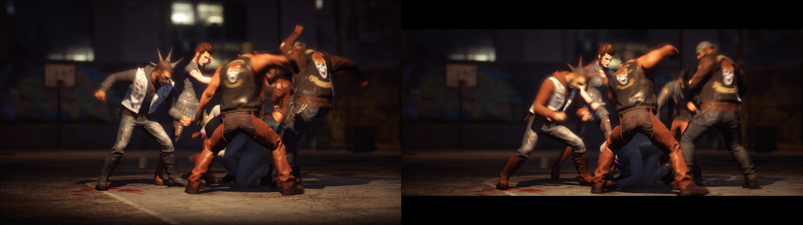

## Saints Row: The Third Remastered Letterbox remover

The small [patcher](/../../releases) removes the top and bottom black bars (letterboxing) from the cutscenes of the game. This is particularly useful at 21:9 and wider aspect ratios where the black bars cause the vertical field of view to be reduced compared to 16:9.

Tested on the latest Epic Games Store version at 1920x1080, 2560x1080, and 3840x1080.

You can buy me a [coffee](https://ko-fi.com/rozziroxx) or become a [patron](https://www.patreon.com/rozzi).

